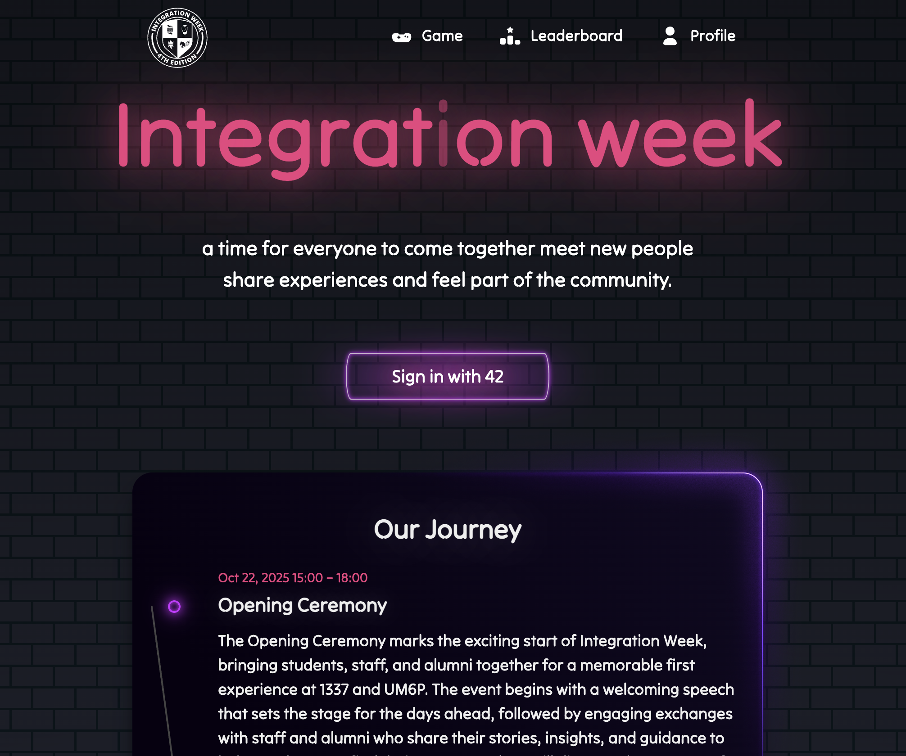
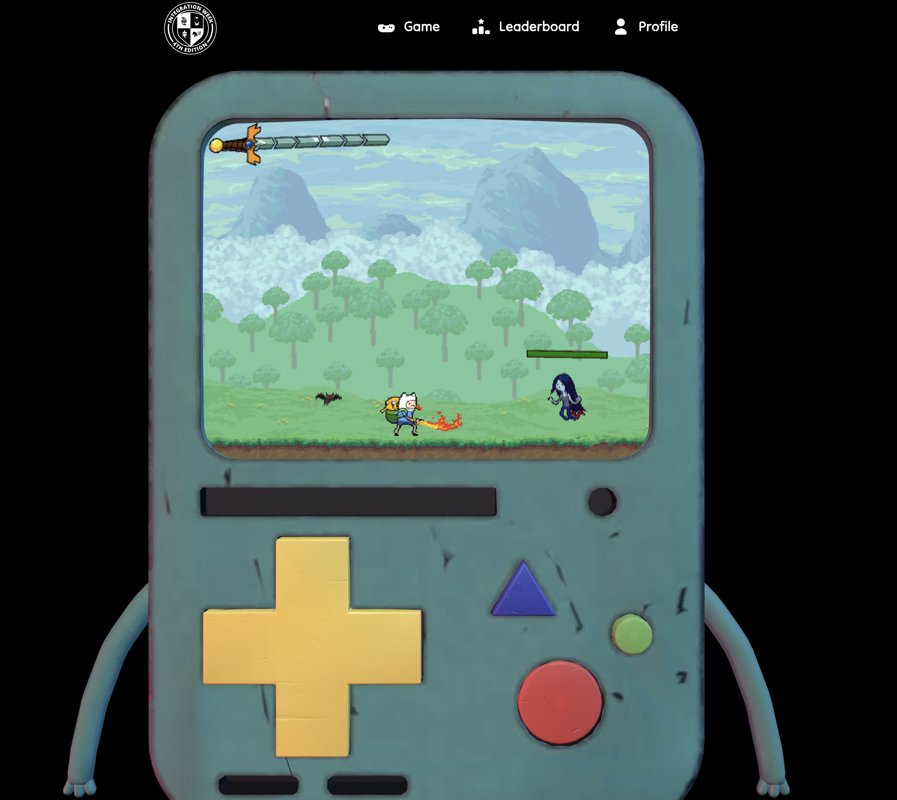
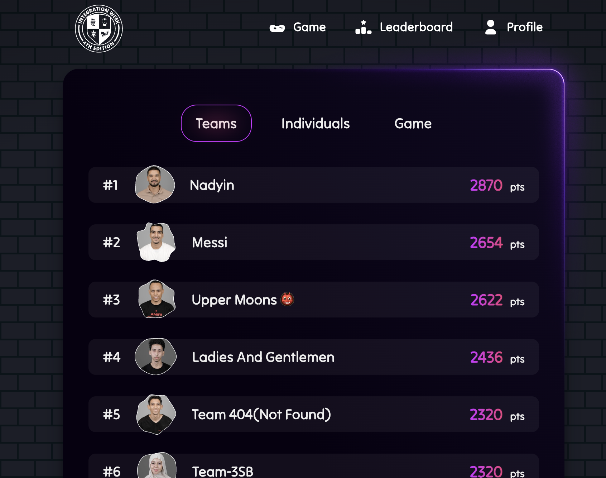

# 1337play

Integration Week platform for [1337](https://1337.ma), a coding school in Morocco part of the [42 Network](https://42.fr). New students log in with their 42 account, get assigned to a team, and can play a game. Game masters scan QR codes to award points during events. Admins handle the rest from a dashboard.

Live at [1337play.com](https://1337play.com)



## Stack

React + Vite + Tailwind on the frontend, Fastify + MongoDB on the backend. Auth through 42 OAuth. The game uses Three.js and a custom 2D engine. Deployed on a VPS with nginx, systemd, and Cloudflare. pnpm workspaces monorepo.

## Features

Students can check their profile (team, points, QR code), play the game, and browse the leaderboards. There are three: team standings, individual points from event scans, and game scores.

Game masters award points by scanning or typing a player's 42 login, tied to a specific event.

Admins have a dashboard for events, teams, organizers, and points.

## Game



Runs in a sandboxed iframe and communicates with the parent page via postMessage. Score is computed server-side from session duration. Only new personal bests are saved and added to the player's total.

## Leaderboard



Team standings, individual points from event scans, and game scores. New students only on the individual ranking.

## Setup

Requires Node, MongoDB, and pnpm.

```bash
git clone https://github.com/reda-rochd/retro_website
cd retro_website
pnpm install
```

Copy `server/.env.example` to `server/.env` and fill in the values.

```bash
cd server && pnpm dev   # API on :3001
cd web && pnpm dev      # frontend on :5173
```

## Deployment

VPS with nginx, systemd, Cloudflare, and Let's Encrypt. nginx proxies `/api` to Fastify and serves the built frontend. Config files and `deploy.sh` are in the repo root.
